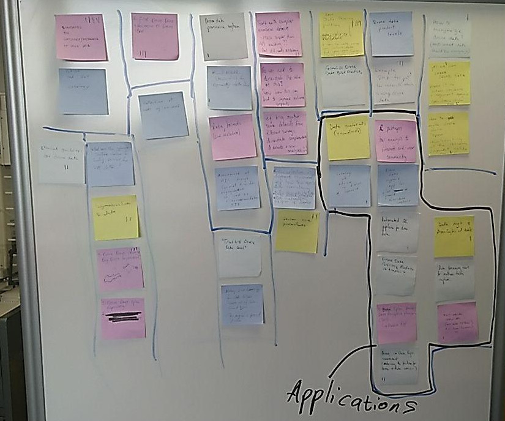

# WG foci collection via unconference

At the RDA's [14th plenary](https://www.rd-alliance.org/plenaries/rdas-14th-plenary-helsinki-finland) in Helsinki (23-25 October 2019) the sUAS Data IG session was run as a mini-unconference so as to gauge the group's interest in forming a WG and what topics should be covered.  The following is an account of all the topics proposed and the votes each recieved.

The session notes are also available in this [google doc](https://docs.google.com/document/d/1tWWIcleALPswtUa2zxPWCsQ2WNlwbGse9DZwL_LUYtE/edit#heading=h.7bguaxabrnxc).

## Topics proposed along with their votes:
Unconference mechanics used:
- Everyone was given 5min to propose topics to postits
- Everyone was told to vote for 3 topics and 1 extra for the "Drone Applications" grouping

In an attempt to identify foci topics have been grouped according to theme although there are clearly instances where a topic could be placed in multiple groups.  Topics were grouped slightly differently before we voted due to time constraints and rushing.  Regrouping has been done to identify correctly dominant themes and topics per votes.

|  | **Votes** |
|------------------------------|-----------|
| **Grp1: Legal and Ethical** |**9**|
| Best Data Sharing practices + how to make sure you collect data that you can share (license, privacy)|4|
| How to anonymise drone data (And what data should be anonymised)|1|
| Yes we can share drone data!  Paper to address concerns and arguments against open drone data!? |1|
| How to make drone data "open" counteracting all the concerns/arguments not to share|1|
| Ethical guidelines for drone data|2|
| Make sure licensing for data reuse keeps up with data product types (this may be a general problem)|0|
| **Grp2: Standards / Best Practices**|**6**|
| Standards for ontology/metadata of drone data |4|
| Standard UxV Ontology |0|
| Data and metadata formats |0|
| Assessment of MIF through formal and wider engeagment to lead to a recommendation|0|
| Formalise drone data best practices|0|
| Drone data product levels|0|
| Example DMP for the research project which is using drone data|2|
| Data Postcards of standards|0|
| **Grp3: Infrastructure** |**5**|
| What are the cyberinfrastructure challenges for scaling services for UxS data?|0|
| Infrastructure for data|2|
| Drone data storage and big data infrastructure|3|
| Drone data open repository|0|
| Trusted drone data seal|0|
| **Grp4: Applications**|**5**|
| R packages for analysis to interest end user community|0|
| Drone data support app for pilot and ground metadata capture|0|
| Automated 2C pipeline for drone data |1|
| Drone data Reference products as templates|0|
| Open drone data analytics platform (tool) - mobile app|0|
| Drone data repo environment (reducing the friction for drone or data novices)|2|
| Multilingual open API (not just python) Eg: Java., JS, etc |1|
| Data streaming environment for real time data capture|0|
| Data management and analytical tasks |1|
| **Grp5 Data Quality**|**3**|
| Data Collection in different environments and how this affects data consistency|0|
| Catalog of advise re drones and sensors|1|
| Sensor use procedures |2|
| **Grp 6: Other**|**N/A**|
| FAIR Drone Data Education to Drone Users|**3**|
| Extending lifespan of drones |0|
| **Grp 7: Provenance**|**2**|
| Drone data provenance system|1|
| Mutual metadata standard(s) for representing data flows|1|
| **Grp 8: Value of drone DMP**|0|
| Data reusablity in different research |0|
| Start with exemplar annotated datasets (easier than API building, but still needs ontology) |0|
| Do we need to demonstrate the value of this?  Show how this can lead to improved outcomes and impacts |0|
| Eg: Bring together some datasets from different surveys, demo complementarity of datasets + new analyses|0|
| Collection of sUAS example use cases|0|

